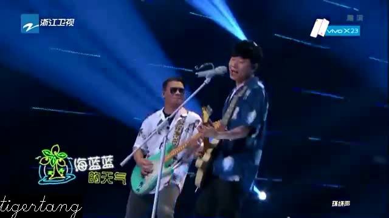

# Video Merger

A simple tool that can combine a video and several pictures into a complete video.

## Prerequisite

1. `boost` and `opencv`
2. `-std=c++17`
3. `cmake`

## Build

1. `cmake .`
2. `make`

## Usage

- Use `bin/main --help` to show help message

```
  --help                            Help screen.
  --video_path arg                  The path of input video.
  --picture_paths arg               The paths of pictures.
  --output_path arg (=output.avi)   The output video path.
  --watermark_text arg (=tigertang) A line of text which will be placed on the
                                    bottom of video. Default value is author's
                                    name.
```

- Running sample

```
> bin/main --video_path video.mp4 --picture_paths 1.jpg 2.jpg 3.jpg 
video_path = "video.mp4"
output_path = "output.avi"
watermark_text = "tigertang"
picture_paths[0] = "1.jpg"
picture_paths[1] = "2.jpg"
picture_paths[2] = "3.jpg"
Generating progress: 100.00%
```

## Screen shots

### Transition between slides


### Play video

